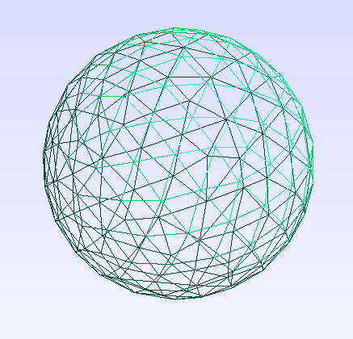

Basic operations with polyhedra and numpy 
=========================================



This set of functions offer the following functionality using well-known algorithms,
with only `numpy` as dependency:

* Determine whether a set of **points are inside/outside a polyhedron**, based on the
surface triangles.
* Compute the **surface** of the polyhedron.

If we also have a tetrahedral mesh, we can

* Determine if the points are inside/outside the volume, based on the tetrahedral mesh.
* Compute the **volume** of the polyhedron.

We need a polyhedron in the form of **vertices**, **triangle indices** and/or 
**tetrahedron indices**, arranged as rows in matrices. We can start with empty matrices:

```python
import numpy as np

p = np.zeros((0, 3))
s = np.zeros((0, 3), dtype=np.int)
v = np.zeros((0, 4), dtype=np.int)
```
 
Here we can create a dummy example with [pygmsh](https://github.com/nschloe/pygmsh). For example a sphere of radius 1:

```python
import pygmsh

geom = pygmsh.opencascade.Geometry()
geom.add_ball([0, 0, 0], 1)
mesh = pygmsh.generate_mesh(geom, dim = 3)

p = mesh.points # Points as Npx3 matrix
s = np.vstack([ c.data for c in mesh.cells if c.data.shape[1] == 3])
v = np.vstack([ c.data for c in mesh.cells if c.data.shape[1] == 4])
```

Our mesh `p`, `s`, `v` (in this case with 205 vertices, 320 triangles and 679 tetrahedrons)
looks like this:

```console
>>> print(p)
[[0.         0.         2.        ]
 [0.         0.         0.        ]
 [0.         1.         2.        ]
 ...
 [0.19986275 0.56127981 0.9703212 ]
 [0.56111425 0.44002365 1.13290636]
 [0.79316896 0.72949658 1.62908032]]
 
>>> print(s)
[[ 15   0 107]
 [  0  16 107]
 [  1   8 108]
 ...
 [284 285 277]
 [278 289 282]
 [281 285 283]]
 
>>> print(v)
[[295 293 301 344]
 [211 298 124 308]
 [297 301 293 344]
 ...
 [307  80 219  95]
 [201 258  66 230]
 [ 66 258 201 244]]

```

If we don't have either the triangles or tetrahedron matrices, we can continue with
an empty 0x3 or 0x4 matrix.
Once we have the data, let's get the sizes and group the points per triangle/tetrahedron
as **numpy cubes**:
 

```python
Np = p.shape[0]   # Number of vertices.
Ns = s.shape[0]   # Number of triangles defining the surface.
Nv = v.shape[0]   # Number of tetrahedrons defining the volume.
ps = p[s, :]      # Triangles as Nsx3x3 cube of vertices.
pv = p[v, :]      # Tetrahedrons as Nvx4x3 cube of vertices.
```
 
We compute the **affine transformations** to each tetrahedron, if present

```python
v0 = pv[:, 0, :]           # Origin of every tetrahedron as Nvx3 matrix.
v0 = np.expand_dims(v0, 1) # Rearranged as Nvx1x3 cube.
fV = pv[:, 1:, :] - v0     # Transformation matrix of every tetrahedron as Nvx3x3 cube.
```

and to each triangle:

```python
s0 = ps[:, 0, :]           # Origin of every triangle as Nsx3 matrix.
s0 = np.expand_dims(s0, 1) # As Nsx1x3 cube.
fS = ps[:, 1:, :] - s0     # Rectangular transformation matrix of every triangle as a Nsx2x3 cube.
```

We can now **compute the volume and area of the polyhedron** by computing the **determinant** of the transformations:

```python 
detV = np.linalg.det(fV)                      # Determinant of the tetrahedron transformations (area of each parallelepiped).
sn = np.cross(fS[:, 0, :], fS[:, 1, :])       # Normal vectors to the surface elements.
detS = np.sqrt(np.prod(np.sum(fS*fS, 2), 1) -
               np.sum(np.prod(fS, 1), 1)**2)  # "Determinant" of the triangle transformations (area of each parallelogram).
V = np.sum(np.abs(detV)/6)                    # Volume.
S = np.sum(np.abs(detS)/2)                    # Surface area.
```

For this mesh size, the values seems close to the analytical surface and volume of a sphere:


```console
>>> R = 1
>>> print(S)
12.323940939103384
>>> print(4*np.pi*R**2)
12.566370614359172
>>> print(V)
4.042168310499373
>>> print(4/3*np.pi*R**3)
4.1887902047863905
```

The inverse transformations will help us compute the **barycentric coordinates**

```python 
fVi = np.linalg.inv(fV)  # Inverse transformation matrix per tetrahedron.
fSi = np.linalg.pinv(fS) # Inverse transformation matrix per triangle.
```

which we can use to **determine if a point is inside the volume**, using the tetrahedrons:

```python 
q = np.random.uniform(-1, 1, (1, 3))        # Some random point in the box [-1,-1]^3.
u = (q - v0)@fVi                            # Barycentric coordinates inside the tetrahedrons, as NvxNqx3
iT = np.all(u > 0, 2) & (np.sum(u, 2) < 1)  # We check that each point is inside each tetrahedron, as NvxNq
insideV = np.any(iT, 0)                     # We collapse into an Nq array of booleans, for each point inside any tetrahedron
```

or to **determine if a point is inside the surface**, using the triangles via
[intersecting a random ray](https://en.wikipedia.org/wiki/Point_in_polygon#Ray_casting_algorithm)
from the test point to the surface, and counting
the  number of intersections from the ray in the forward direction:

```python 
rv = np.random.uniform(-1, 1, (1, 3))           # Random ray.
    
sh = max(rv.shape, q.shape)                     # Shape rearrangement to allow multiple test points/rays.
rv = np.broadcast_to(rv, sh)
q  = np.broadcast_to(q, sh)
    
opn = (q - s0) @ np.expand_dims(sn, 2)          # Cube NsxNqx1 with dot products (q - s0).n per test point and triangle.
vn = sn@rv.T                                    # Dot product v·n per triangle, as NsxNq.
k = -opn.reshape(vn.shape)/vn                   # Intersection constants.

pc = np.expand_dims(q, 0) + \
     np.expand_dims(rv, 0)*np.expand_dims(k, 2) # Intersection points between rays and triangle planes as a cube cube NvxNqx1.
u = (pc - s0) @ fSi                             # 2D barycentric coordinates per triangle, as NsxNqx2.
iT = np.all(u > 0, 2) & (np.sum(u, 2) < 1)      # NsxNq booleans telling us which intersections are inside each triangle.
iT &= k > 0                                     # Only in the direction of the ray(s).
insideS = np.sum(iT, 0) % 2 == 1                # We collapse into an Nq array of booleans.
```

Both methods should wive us the same results:

```python 
assert(np.all(insideV == insideS)) # equal
```

The volume and surface methods work with several test points and/or several rays. 
For example:

```python
q = np.random.uniform(-1, 1, (10000, 3)) # points to test as a Nqx3 array
```

Beware that for large dimensions of both mesh and points/rays, this is not the
most efficient method in memory and CPU time, so remember to **split your data in chunks**.
For example for the volume method:

```python
def isInsideV(q):
    u = (q - v0)@fVi                            # coordinates inside the tetrahedrons, as NvxNqx3
    iT = np.all(u > 0, 2) & (np.sum(u, 2) < 1)  # we check that each point is inside each tetrahedron, as NvxNq
    insideV = np.any(iT, 0)
    return insideV

chunk_size = 50
chunk_num = max(1, q.shape[0] // chunk_size)
chunks = np.array_split(q, chunk_num, axis = 0)
insideV_chunks = np.hstack([isInsideV(chunk) for chunk in chunks])
```

We see that the ratio of points falling inside the sphere is similar to the ratio of
volumes of unit sphere and cube [-1, 1]^3

```console
>>> np.sum(insideV_chunks)/len(q)
0.5062
>>> V/2**3
0.5052710388124216
```
